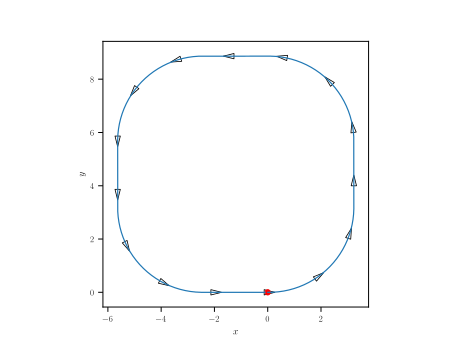

# Rigid Body
A simple python package contains basic rigid body formalism, like rotations, homogeneous transformations, 
kinematics as well as some plotting functionalities.

Examples:

* Basic rotations in 2d and 3d plus homogeneous transformations:
    ```python
    import numpy as np
    import rigidbody.transformations as trans
    import rigidbody.plotter as plotter
    R = trans.rotation_matrix_z(np.pi/6)@trans.rotation_matrix_y(np.pi/3)@trans.rotation_matrix_z(np.pi/6)
    trans.euler_angles_from_rot_matrix(R)*180/np.pi
    ```
* Basic Kinematcis and trajectory plotting.
    ```python
    import numpy as np
    import rigidbody.transformations as trans
    import rigidbody.kinematics as kine   
    import rigidbody.plotter as plotter
    def kinematic_dynamic(x, nu):
        """
        Kinematic of a two-dimensional movement.
        The state x contains (x,y,phi).

        Parameters
        ----------
        t: float
        x: np.ndarray (3,)

        Returns
        -------
        dx_dt: np.ndarray (3,)
        """
        j_inv = kine.inverse_analytical_jacobian_2d(x[-1])
        return j_inv@nu
    x_init = np.array([0.,0.,0.])
    N_t = 300
    dt = 1e-2
    t_span = np.arange(N_t)*dt
    x_t = np.zeros((t_span.shape[0],3))
    x_t[0] = x_init
    v = 10*np.ones_like(t_span)
    zeros_portion = np.pi*np.zeros((25,))
    ones_portion = np.pi*np.ones((25,))
    phi_dot = np.concatenate([ones_portion,ones_portion,zeros_portion,ones_portion,ones_portion,zeros_portion,ones_portion,ones_portion,zeros_portion,ones_portion,ones_portion,zeros_portion])
    # phi_dot = np.random.randn(t_span.shape[0])*np.pi
    nu_t = np.block([[v],
                     [np.zeros_like(t_span)],
                    [phi_dot]])
    nu_t = nu_t.T
  
    # Euler propagation
    for i in range(t_span.shape[0]-1):
        x_t[i+1] = x_t[i] + dt* kinematic_dynamic(x_t[i],nu_t[i])
    ax = plotter.two_d_trajectory_attitude_plot(x_t,0.10,20,color="black")
    ax.set_aspect("equal")
    ax.scatter(x_t[0,0],x_t[0,1],s=30,color='red')
    ax.set_xlabel(r"$x$")
    ax.set_ylabel(r"$y$")
    ```
    

Check `notebooks` folder for more.
